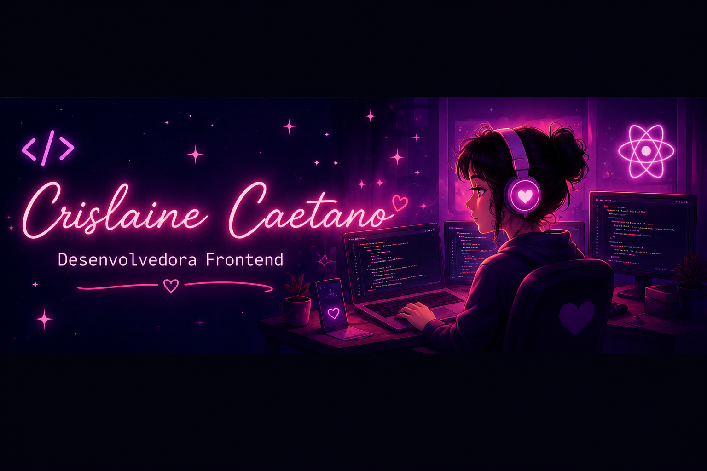

<div align="center">



# < Olá, eu sou Crislaine! 👋 />

### 💜 Desenvolvedora Frontend
### 🎓 Estudante de Engenharia de Software e Técnico em Desenvolvimento de Sistemas


</div>

---

<table>
<tr>

<td width="50%">

## ✨ Sobre mim

Sou apaixonada por tecnologia e desenvolvimento. 💜

🎓 Estudante de Engenharia de Software  
💻 Técnica em Desenvolvimento de Sistemas  
🚀 Focada em Frontend  
🌸 Criando interfaces modernas e responsivas e experiências incríveis 🚀


</td>

<td width="50%">

```javascript
const sobreMim = {
 nome: "Crislaine Caetano",
 foco: "Desenvolvimento Frontend",
 estudando: ["React", "SQL", "JavaScript"],
 objetivo: "Trabalhar na área tech",
 paixao: "Criar interfaces modernas 💜"
}

console.log(sobreMim);
```

</td>

</tr>
</table>

---

# 🚀 Tecnologias

<div align="center">

<table>
<tr>

<td align="center" width="120">
<br>
HTML5
</td>

<td align="center" width="120">
<br>
CSS3
</td>

<td align="center" width="120">
<br>
JavaScript
</td>

<td align="center" width="120">
<br>
React
</td>

<td align="center" width="120">
<br>
Git
</td>

<td align="center" width="120">
<br>
GitHub
</td>

<td align="center" width="120">
<br>
SQL
</td>

<td align="center" width="120">
<br>
Figma
</td>

<td align="center" width="120">
<br>
VS Code
</td>

</tr>
</table>

</div>

---

# 💻 Projetos em destaque

<div align="center">

<table>
<tr>

<td align="center" width="25%">

## 🌐 Site ONG

Site institucional responsivo.

`HTML` `CSS` `JS`

<a href="LINK1">

</a>

</td>

<td align="center" width="25%">

## 🗄️ SQL Database

Projeto de banco de dados SQL.

`SQL` `MySQL`

<a href="LINK2">

</a>

</td>

<td align="center" width="25%">

## ⚛️ Projeto React

Aplicação React moderna.

`React` `JS`

<a href="LINK3">

</a>

</td>

<td align="center" width="25%">

## 🎨 Landing Page

Landing page responsiva.

`HTML` `CSS`

<a href="LINK4">

</a>

</td>

</tr>
</table>

</div>

---

# 📊 Estatísticas

<div align="center">

<table>
<tr>

<td align="center">

## 📈 GitHub Stats


</td>

<td align="center">

## 🔥 GitHub Streak


</td>

<td align="center">

## 💻 Linguagens Mais Usadas


</td>

</tr>
</table>

</div>

---
# 🐍 Contribuições

<div align="center">

<table>
<tr>

<td align="center" width="60%">


</td>

<td align="center" width="40%">

## 👀 Visitantes


<br>

### 💜 Visitas ao perfil
</td>

</tr>
</table>

</div>

---

# 🌸 Redes Sociais

<div align="center">

<a href="https://www.linkedin.com/in/crislaine-caetano-968a20350">

</a>

<a href="https://instagram.com/cristech.code">

</a>

<a href="mailto:crislainecaetano51@gmail.com">

</a>

</div>


---

<div align="center">

### ✨ "Transformando ideias em interfaces incríveis." 💜

</div>
